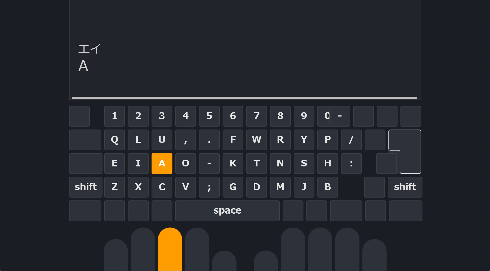

# tampermonkey-scripts

[Tampermonkey](https://www.tampermonkey.net/) 用ユーザースクリプト集。

## スクリプト一覧

### Claude.ai (`https://claude.ai/*`)

| ファイル | 概要 |
|---|---|
| [claude_utility.user.js](claude_utility.user.js) | 軽量ユーティリティ詰め合わせ。Tampermonkeyメニューから個別ON/OFF。下記4機能を内包: |
| | ・**Hide GDrive Button**: ファイル生成カードのGoogle Driveエクスポートボタンを非表示化 |
| | ・**Adaptive Width**: アーティファクト非表示時のみチャット幅を拡張 |
| | ・**Ctrl+Enter Send**: Enter / Shift+Enter で改行、Ctrl+Enter で送信 |
| | ・**Done Beep**: 出力完了時にWebAudio合成のチャイム音(自動継続対応) |
| [claude_auto_continue.user.js](claude_auto_continue.user.js) | 「続ける」「再試行」ボタンを自動クリック(メニューから個別ON/OFF) |
| [claude_artifact_diff.user.js](claude_artifact_diff.user.js) | アーティファクト更新時に前バージョンとの差分をブラウザ内表示 |

### e-typing (`https://*.e-typing.ne.jp/*`)

[AdGuard](https://adguard.com/) で広告ブロックしていることを前提とした作り(広告非表示によるレイアウト/挙動を想定)。

| ファイル | 概要 |
|---|---|
| [etyping_utility.user.js](etyping_utility.user.js) | 汎用ユーティリティ詰め合わせ。Tampermonkeyメニューから個別ON/OFF。下記4機能を内包: |
| | ・**New Tab**: 練習リンクをモーダルではなく新タブで開く |
| | ・**Space Replay**: スタート/リザルト画面でスペース押下でゲーム開始 or リロード |
| | ・**Dark Mode**: タイピングアプリ画面全体をダーク配色に |
| | ・**Column Staggered**: キーボードの段ごとの横ズレを排除し縦に整列 |
| [etyping_onishi_keyboard.user.js](etyping_onishi_keyboard.user.js) | 仮想キーボードの表示・次キーハイライト・指ガイドをQWERTY→[大西配列](https://o24.works/layout/)に置換 |

全機能ONの状態(タイピング画面):

## インストール

1. ブラウザに [Tampermonkey](https://www.tampermonkey.net/) 拡張をインストール
2. 下記の各スクリプトの **Raw URL** をクリックすると Tampermonkey のインストール画面が開く
3. 内容を確認して「インストール」

### Raw URL 一覧

#### Claude.ai

- [claude_utility.user.js](https://raw.githubusercontent.com/KiyonakaNata/tampermonkey-scripts/main/claude_utility.user.js)
- [claude_auto_continue.user.js](https://raw.githubusercontent.com/KiyonakaNata/tampermonkey-scripts/main/claude_auto_continue.user.js)
- [claude_artifact_diff.user.js](https://raw.githubusercontent.com/KiyonakaNata/tampermonkey-scripts/main/claude_artifact_diff.user.js)

#### e-typing

- [etyping_utility.user.js](https://raw.githubusercontent.com/KiyonakaNata/tampermonkey-scripts/main/etyping_utility.user.js)
- [etyping_onishi_keyboard.user.js](https://raw.githubusercontent.com/KiyonakaNata/tampermonkey-scripts/main/etyping_onishi_keyboard.user.js)

各スクリプトのヘッダに `@updateURL` / `@downloadURL` が設定されているため、
**インストール後は git push する度に Tampermonkey が自動更新を取得** します(デフォルト約24時間ごと、手動更新は Tampermonkey ダッシュボードの「アップデートを確認」から)。

## バージョン管理

- ファイル名にはバージョンを含めない
- バージョンはスクリプト内の `@version` ヘッダで管理する
- 変更履歴は git のコミット履歴を参照

## License

[MIT License](LICENSE) — 改変・再配布・商用利用すべて自由です(著作権表記とライセンス文の同梱のみ条件)。
